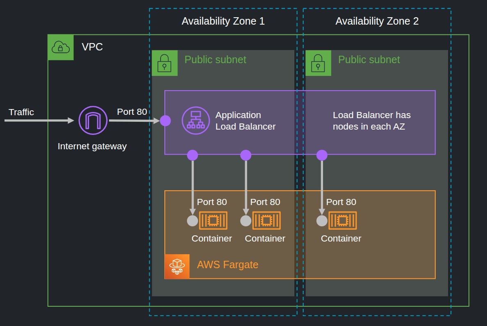

# Serverless public facing website hosted on AWS Fargate

https://containersonaws.com/pattern/public-facing-web-ecs-fargate-cloudformation

## About
About​
A public facing web service is one of the most common architecture patterns for deploying containers on AWS. It is well suited for:

A static HTML website, perhaps hosted by NGINX or Apache
A dynamically generated web app, perhaps served by a Node.js process
An API service intended for the public to access
An edge service which needs to make outbound connections to other services on the internet
With this pattern you will deploy a serverless container through Amazon ECS, which is hosted on AWS Fargate capacity.

NO HTTPS

-----------------------------------------------------------------------
**WARNING**

This pattern is not well suited for:

A private internal API service
An application that has very strict networking security requirements
For the above use cases instead consider using the private subnet version of this pattern, designed for private API services.
https://containersonaws.com/pattern/public-facing-api-ecs-fargate-cloudformation
-----------------------------------------------------------------------

## Architecture



```sh
# Deploy the stack
sam deploy \
  --template-file parent.yml \
  --stack-name serverless-web-environment \
  --resolve-s3 \
  --capabilities CAPABILITY_IAM

# Remove
sam delete --stack-name serverless-web-environment
```